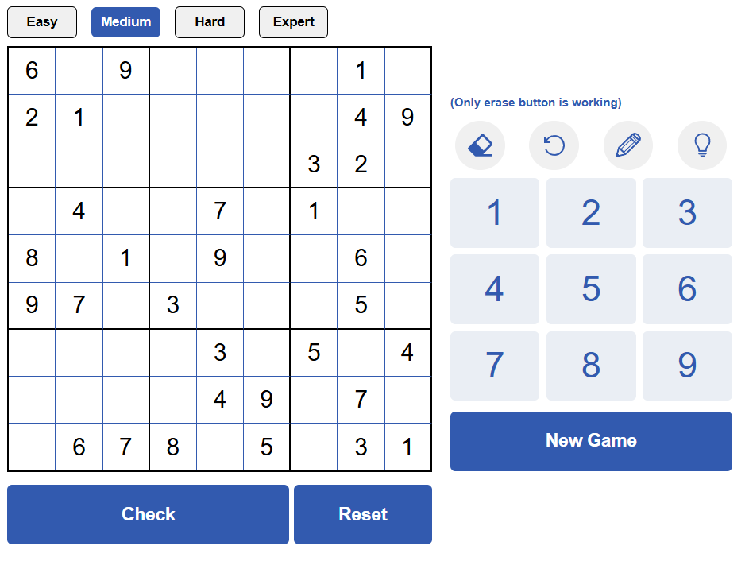

# 🧩 Sudoku

A simple, interactive Sudoku game built using HTML, CSS, and JavaScript. This project allows users to play Sudoku directly in the browser, with basic functionality like puzzle generation, input validation, and a clean, responsive interface.

 

## 🚀 Features
- Interactive Grid: 9x9 Sudoku grid that responds to user clicks
- Difficulty Modes: Easy, Medium, Hard, Expert
- Number Pad: Fill cells by clickng numbers
- Erase Tool: Clear cell contents (if editable)
- Validation: Check if the current board is complete and correct, and get feedback
- New Game & Reset: Create new puzzles or return to the original state
- Puzzle Generator: Dynamically creates boards with unique solutions

## 🛠️ Tech Stack / Tools

- HTML
- CSS 
- Javascript

## Usage

- The board is rendered using HTML table/grid or JavaScript dynamically.
- Users can click on cells and enter numbers 1-9.
- Basic rules of Sudoku are enforced: no repeated numbers in rows, columns, or 3x3 grids.

## Future Additions to look into
- Implement a storage system for puzzles
- Implement a functionality that allows puzzles to be preloaded at each difficulty level from previous attempts
- Implement an undo button
- Implement a pencil mode that allows user to plan their placements
- Add hints and step-by-step solving
- Timer or scoring system
- Animation for transitions/interactions
